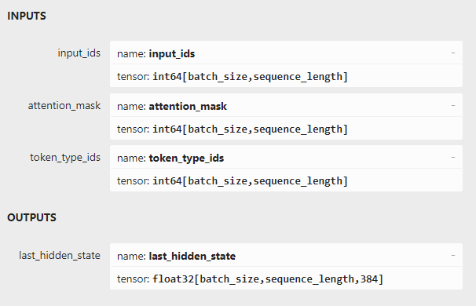

# Sentence Embeddings in Android

> An Android library that provides a port to sentence-transformers, which are used to generate sentence embeddings (fixed-size vectors for text/sentences)

[](https://jitpack.io/#shubham0204/Sentence-Embeddings-Android)


* Read the blog: [From Python To Android: HF Sentence Transformers (Embeddings)](https://proandroiddev.com/from-python-to-android-hf-sentence-transformers-embeddings-1ecea0ce94d8)

## Updates

### 2025-03

- Move the Rust source code from the `libs` branch to the `main` branch: We now use the [rust-android-plugin](https://github.com/mozilla/rust-android-gradle/issues/29) to initiate `cargo build` from Gradle

- Removed Git LFS: The ONNX models present in `app/src/main/assets` have been removed from the repository. Instead, `app/build.gradle.kts` downloads the models and tokenizer configs from HuggingFace using `download_model.sh` shell script.

- Add [Model2Vec](https://huggingface.co/blog/Pringled/model2vec): Model2Vec provides static sentence-embeddings through a fast-lookup

- Remove Jitpack: A GitHub CI script now builds AARs for `model2vec` and `sentence_embeddings` Gradle modules that can be included in other projects

### 2024-08

- Along with `token_ids` and `attention_mask`, the native library now also returns `token_type_ids` to support additional models like the `bge-small-en-v1.5` (issue #3)

## Supported Models

- [`all-minilm-l6-v2`](https://huggingface.co/sentence-transformers/all-MiniLM-L6-v2/tree/main)
- [`bge-small-en-v1.5`](https://huggingface.co/BAAI/bge-small-en-v1.5)
- [`snowflake-arctic-embed-s`](https://huggingface.co/Snowflake/snowflake-arctic-embed-s)

To add more models, refer the [Adding New Models](#adding-new-models) section. 

## Installation

The AARs for the `sentence_embeddings` and `model2vec` modules are available in the [Releases](https://github.com/shubham0204/Sentence-Embeddings-Android/releases) which can be downloaded. Add the AARs to the `app/libs` directory and then in `app/build.gradle.kts`,

```kotlin
dependencies {
    // ...
    // Add one or both of them as needed
    implementation(file("libs/sentence_embeddings.aar"))
    implementation(file("libs/model2vec.aar"))
    // ...
}
```

## Building the Project

# Build Instructions

1. Set up Android NDK version r27c
   ```bash
   # Using the nttld/setup-ndk action
   # Example manual equivalent:
   wget https://dl.google.com/android/repository/android-ndk-r27c-linux.zip
   unzip android-ndk-r27c-linux.zip
   export ANDROID_NDK_HOME=/path/to/android-ndk-r27c
   ```

2. Install Rust targets for Android
   ```bash
   rustup target add aarch64-linux-android armv7-linux-androideabi i686-linux-android x86_64-linux-android
   ```

3. Build the Rust code
   ```bash
   ./gradlew cargoBuild --stacktrace
   ```

4. Build AAR for sentence_embeddings module
   ```bash
   ./gradlew :sentence_embeddings:assembleRelease --stacktrace
   ```

5. Build AAR for model2vec module
   ```bash
   ./gradlew :model2vec:assembleRelease --stacktrace
   ```

6. Build APK for app module
   ```bash
   ./gradlew :app:assembleRelease --stacktrace
   ```

7. Build APK for app-model2vec module
   ```bash
   ./gradlew :app-model2vec:assembleRelease --stacktrace
   ```

## Usage

### API

The library provides a `SentenceEmbedding` class with `init` and `encode` suspend functions that initialize the model and generate the sentence embedding respectively. 

The `init` function takes two mandatory arguments, `modelBytes` and `tokenizerBytes`.

```kotlin
import com.ml.shubham0204.sentence_embeddings.SentenceEmbedding

val sentenceEmbedding = SentenceEmbedding()

// Download the model and store it in the app's internal storage
// (OR) copy the model from the assets folder (see the app module in the repo)
val modelFile = File(filesDir, "model.onnx")
val tokenizerFile = File(filesDir, "tokenizer.json")
val tokenizerBytes = tokenizerFile.readBytes()

CoroutineScope(Dispatchers.IO).launch {
    sentenceEmbedding.init(
        modelFilepath = modelFile.absolutePath,
        tokenizerBytes = tokenizerBytes,
        useTokenTypeIds = false,
        outputTensorName = "sentence_embedding",
        useFP16 = false,
        useXNNPack = false
    )
}
```

Once the `init` functions completes its execution, we can call the `encode` function to transform the given `sentence` to an embedding,

```kotlin
CoroutineScope(Dispatchers.IO).launch {
    val embedding: FloatArray = sentenceEmbedding.encode( "Delhi has a population 32 million" )
    println( "Embedding: $embedding" )
    println( "Embedding size: ${embedding.size}")
}
```

### Compute Cosine Similarity

The embeddings are vectors whose relative similarity can be computed by measuring the cosine of the angle between the vectors, also termed as *cosine similarity*,

> [!TIP]
> Here's an excellent [blog](https://towardsdatascience.com/cosine-similarity-how-does-it-measure-the-similarity-maths-behind-and-usage-in-python-50ad30aad7db) to under cosine similarity

```kotlin
private fun cosineDistance(
    x1: FloatArray,
    x2: FloatArray
): Float {
    var mag1 = 0.0f
    var mag2 = 0.0f
    var product = 0.0f
    for (i in x1.indices) {
        mag1 += x1[i].pow(2)
        mag2 += x2[i].pow(2)
        product += x1[i] * x2[i]
    }
    mag1 = sqrt(mag1)
    mag2 = sqrt(mag2)
    return product / (mag1 * mag2)
}

CoroutineScope(Dispatchers.IO).launch {
    val e1: FloatArray = sentenceEmbedding.encode( "Delhi has a population 32 million" )
    val e2: FloatArray = sentenceEmbedding.encode( "What is the population of Delhi?" )
    val e3: FloatArray = sentenceEmbedding.encode( "Cities with a population greater than 4 million are termed as metro cities" )
    
    val d12 = cosineDistance( e1 , e2 )
    val d13 = cosineDistance( e1 , e3 )
    println( "Similarity between e1 and e2: $d12" )
    println( "Similarity between e1 and e3: $d13" )
}
```

## Adding New Models

We demonstrate how the `snowflake-arctic-embed-s` model can be added to the sample application present in the `app` module.

1. Download the [`model.onnx`](https://huggingface.co/Snowflake/snowflake-arctic-embed-s/blob/main/onnx/model.onnx) and [`tokenizer.json`](https://huggingface.co/Snowflake/snowflake-arctic-embed-s/blob/main/tokenizer.json) files from the HF [`snowflake-arctic-embed-s`](https://huggingface.co/Snowflake/snowflake-arctic-embed-s) repository.

2. Create a new sub-directory in `app/src/main/assets` named `snowflake-arctic-embed-s`, the copy the two files to the sub-directory.

3. In `Config.kt`, add a new entry in the `Models` enum and a new branch in `getModelConfig` corresponding to the new model entry added in the enum,

```kotlin
enum class Model {
    ALL_MINILM_L6_V2,
    BGE_SMALL_EN_V1_5,
    SNOWFLAKE_ARCTIC_EMBED_S // Add the new entry
}

fun getModelConfig(model: Model): ModelConfig {
    return when (model) {
        Model.ALL_MINILM_L6_V2 -> ModelConfig(
            modelName = "all-minilm-l6-v2",
            modelAssetsFilepath = "all-minilm-l6-v2/model.onnx",
            tokenizerAssetsFilepath = "all-minilm-l6-v2/tokenizer.json",
            useTokenTypeIds = false,
            outputTensorName = "sentence_embedding"
        )
        Model.BGE_SMALL_EN_V1_5 -> ModelConfig(
            modelName = "bge-small-en-v1.5",
            modelAssetsFilepath = "bge-small-en-v1_5/model.onnx",
            tokenizerAssetsFilepath = "bge-small-en-v1_5/tokenizer.json",
            useTokenTypeIds = true,
            outputTensorName = "last_hidden_state"
        )
        // Add a new branch for the model
        Model.SNOWFLAKE_ARCTIC_EMBED_S -> ModelConfig(
            modelName = "snowflake-arctic-embed-s",
            modelAssetsFilepath = "snowflake-arctic-embed-s/model.onnx",
            tokenizerAssetsFilepath = "snowflake-arctic-embed-s/tokenizer.json",
            useTokenTypeIds = true,
            outputTensorName = "last_hidden_state"
        )
    }
}
```

4. To determine the values for `useTokenTypeIds` and `outputTensorName`, open the model with [Netron](https://github.com/lutzroeder/netron) or load the model in Python with [`onnxruntime`](https://github.com/microsoft/onnxruntime). We need to check the names of the input and output tensors.

With Netron, check if `token_type_ids` is the name of an input tensor. Accordingly, set the value of `useTokenTypeIds` while creating an instance of `ModelConfig`. For `outputTensorName`, choose the name of the output tensor which provides the embedding. For the `snowflake-arctic-embed-s` model, the name of that output tensor is `last_hidden_state`.



The same information can be printed to the console with following Python snippet using the `onnxruntime` package,

```python
import onnxruntime as ort

session = ort.InferenceSession("model.onnx" )

print("Inputs: ")
print( [ t.shape for t in session.get_inputs() ] )
print( [ t.type for t in session.get_inputs() ] )
print( [ t.name for t in session.get_inputs() ] )

print("Outputs: ")
print( [ t.shape for t in session.get_outputs() ] )
print( [ t.type for t in session.get_outputs() ] )
print( [ t.name for t in session.get_outputs() ] )
```

5. Run the app on the test-device
